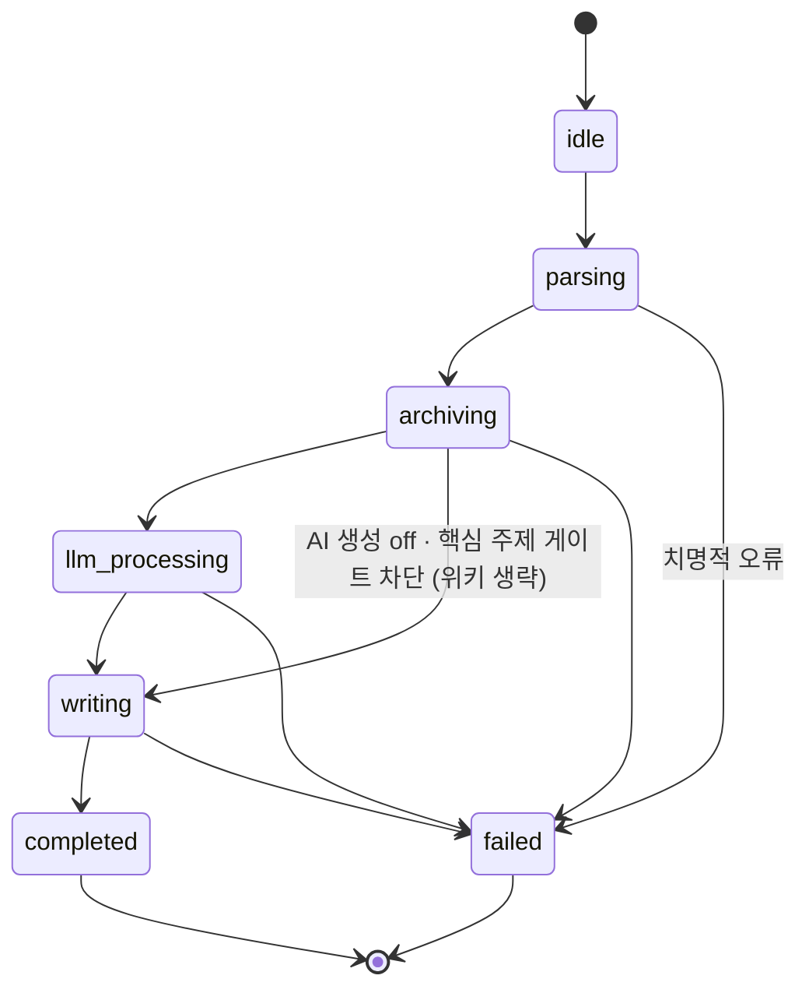

# ImportJob 상태 전이

`ImportJobStatus`([entities.md](../10-contracts/entities.md))의 전이 다이어그램. [import-pipeline.md](import-pipeline.md)의 파이프라인 단계를 상태머신으로 시각화한다.

> 시퀀싱 주체(누가 다음 상태로 넘기는가) = **TS 서비스층**([ADR-0007](../adr/0007-importjob-orchestration-ts.md), option A). Rust `import/`는 각 단계 실행을 담당한다. enum 정의는 [entities.md](../10-contracts/entities.md)가 SSOT.

## 다이어그램

## 상태 설명

| 상태 | 의미 | 실행(Rust) / 주도(TS) |
|---|---|---|
| `idle` | 대기 | — |
| `parsing` | 입력 해석·PDF 텍스트 추출 | `pdf/` `extract_pdf_text` |
| `archiving` | 원문 archive 보존 (덮어쓰기 금지) | `storage/` `save_source_file` + `create_note` |
| `llm_processing` | 요약·개념추출·관계생성 | TS `src/llm/` → `LlmWikiResult` |
| `clarify_pending` | **코드에서 도달하지 않는다.** [entities.md](../10-contracts/entities.md) enum 값으로만 남아 있다(계약 유지) | — |
| `writing` | wiki + relations 영속화 | `storage/` `save_wiki`·`append_relations` |
| `completed` | 종료 (warn/partial 동봉 가능) | — |
| `failed` | 치명적 오류 + `errorMessage` | — |

## 파인만은 파이프라인 단계가 아니다

- 파인만은 사용자가 **노트 에디터에서 언제든 여는 도구**다(제목 줄 호버 버튼 · 드래그 선택 · 인박스 `파인만` pill). 임포트 흐름이 사용자를 붙잡아 세우지 않는다. 상세는 [output-validation §6](../30-llm/output-validation.md).
- 그래서 `llm_processing`에서 사용자 응답을 기다리는 분기는 없다 — 1차 생성 결과가 곧바로 `writing`으로 간다.
- `clarify_pending`은 [entities.md](../10-contracts/entities.md) `ImportJobStatus` enum에 **그대로 남아 있지만**(계약 유지, 2026-05-29 추가) **어떤 코드 경로도 이 상태로 전이하지 않는다.**

## 핵심 주제 게이트

- `archiving` 직후, 위키로 가기 전에 **핵심 주제 게이트**가 한 번 걸린다: Gemini가 노트의 `##` 섹션 중 핵심 주제를 판별하고, 사용자가 파인만에 답하고(answered) "이해했다"고 선언한(understood) 것만 통과시킨다 ([output-validation §6](../30-llm/output-validation.md)).
- 차단되면 `llm_processing`을 건너뛰고 `archiving` → `writing` → `completed`로 끝난다. **노트(`archive/`)는 이미 저장돼 있다 — 막는 것은 위키뿐이다.** 어느 주제가 막는지는 사용자에게 알린다.
- 키가 없거나 판별에 실패하면 게이트를 걸지 않는다(fail-open). AI 생성을 끈 저장도 같은 경로(`archiving` → `writing`)로 끝난다.

## 비치명 vs 치명

- 부분 drop·경고는 `?`로 중단하지 않고 `Outcome`으로 모아 `completed`로 종료([import-pipeline.md](import-pipeline.md) §4, [error-handling.md](error-handling.md)).
- `fatal`만 `failed` 전이 + `errorMessage`.

## 관련

| 문서 | 내용 |
|---|---|
| [import-pipeline.md](import-pipeline.md) | 단계별 호출·경계 |
| [entities.md](../10-contracts/entities.md) | `ImportJobStatus` enum (SSOT) |
| [output-validation.md](../30-llm/output-validation.md) | 파인만(에디터 도구)·핵심 주제 게이트·검증 |
| [ADR-0007](../adr/0007-importjob-orchestration-ts.md) | 오케스트레이션 주도 결정 |
