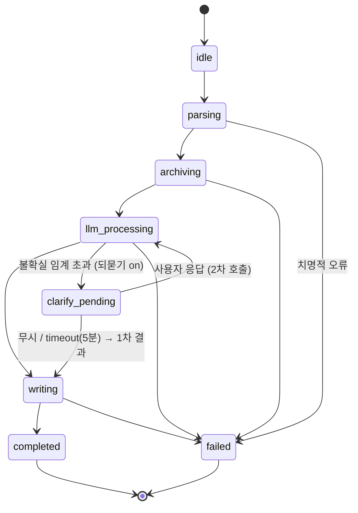

# ImportJob 상태 전이

`ImportJobStatus`([entities.md](../10-contracts/entities.md))의 전이 다이어그램. [import-pipeline.md](import-pipeline.md)의 파이프라인 단계를 상태머신으로 시각화한다.

> 시퀀싱 주체(누가 다음 상태로 넘기는가) = **TS 서비스층**([ADR-0007](../adr/0007-importjob-orchestration-ts.md), option A). Rust `import/`는 각 단계 실행을 담당한다. enum 정의는 [entities.md](../10-contracts/entities.md)가 SSOT.

## 다이어그램

## 상태 설명

| 상태 | 의미 | 실행(Rust) / 주도(TS) |
|---|---|---|
| `idle` | 대기 | — |
| `parsing` | 입력 해석·PDF 텍스트 추출 | `pdf/` `extract_pdf_text` |
| `archiving` | 원문 archive 보존 (덮어쓰기 금지) | `storage/` `save_source_file` + `create_note` |
| `llm_processing` | 요약·개념추출·관계생성 (1차/2차) | TS `src/llm/` → `LlmWikiResult` |
| `clarify_pending` | 되묻기: 사용자 응답 대기 (되묻기 on일 때만) | TS UI (Inbox) |
| `writing` | wiki + relations 영속화 | `storage/` `save_wiki`·`append_relations` |
| `completed` | 종료 (warn/partial 동봉 가능) | — |
| `failed` | 치명적 오류 + `errorMessage` | — |

## 되묻기 (clarify) 분기

- `llm_processing`(1차) 결과가 불확실 임계(예: 평균 relation confidence < 0.5)를 넘으면 `clarify_pending`으로 전이. 트리거·1회 제한은 [output-validation](../30-llm/output-validation.md) §6 SSOT.
- 사용자 응답 → `llm_processing`(2차, 입력 = 원본 + 응답) → `writing`.
- 무시/timeout → `writing`(1차 결과 저장).
- `clarify_pending`은 [entities.md](../10-contracts/entities.md) enum에 정의됨(2026-05-29 추가). 되묻기 토글 off면 이 분기 없이 `llm_processing` → `writing`([ADR-0002](../adr/0002-single-tier-pricing.md)).

## 비치명 vs 치명

- 부분 drop·경고는 `?`로 중단하지 않고 `Outcome`으로 모아 `completed`로 종료([import-pipeline.md](import-pipeline.md) §4, [error-handling.md](error-handling.md)).
- `fatal`만 `failed` 전이 + `errorMessage`.

## 관련

| 문서 | 내용 |
|---|---|
| [import-pipeline.md](import-pipeline.md) | 단계별 호출·경계 |
| [entities.md](../10-contracts/entities.md) | `ImportJobStatus` enum (SSOT) |
| [output-validation.md](../30-llm/output-validation.md) | 되묻기 트리거·검증 |
| [ADR-0007](../adr/0007-importjob-orchestration-ts.md) | 오케스트레이션 주도 결정 |
