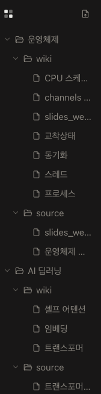

# 디렉토리 바 (Directory Bar)

앱 좌측의 파일 트리 사이드바 영역의 **공식 명칭**. 이슈·PR·커밋·문서 등 GitHub 전반에서 이 영역은 "디렉토리 바"로 통일해 부른다. (영문 표기: Directory Bar)

 wiki/source > 파일 트리" />

---

## 정의

Workspace 전체 vault를 트리로 보여주는 좌측 사이드바. 최상위는 지식 스페이스(KnowledgeSpace), 그 아래 `wiki` / `source` 고정 폴더, 그 아래 파일이 온다. 파일 클릭 시 해당 문서가 에디터 탭으로 열리고, 선택 상태는 열린 탭과 동기화된다.

## 화면 구성

| 영역                      | 설명                                                  |
| ------------------------- | ----------------------------------------------------- |
| 로고 마크 (상단 좌)       | PiecePool 브랜드 마크(2×2 사각형). 클릭 기능 없음     |
| 새 노트 버튼 (상단 우)    | 파일 업로드 아이콘. 현재 스페이스의 캡처/Inbox 열기   |
| 파일 트리                 | 스페이스 → wiki/source → 파일 계층. 본 문서의 주 대상 |
| 리사이즈 핸들 (우측 엣지) | 드래그로 폭 조절                                      |

## 트리 계층

| 깊이 | 노드          | 설명                                                              |
| ---- | ------------- | ----------------------------------------------------------------- |
| 1    | 지식 스페이스 | "운영체제", "AI 딥러닝" 등 KnowledgeSpace 폴더. 드랍 대상         |
| 2    | `wiki`        | LLM이 정리한 WikiPage 문서 목록                                   |
| 2    | `source`      | 사용자 원문(ArchiveNote) 문서 목록. 드랍 대상, 파일은 드래그 가능 |
| 3    | 파일          | 클릭 시 에디터 탭으로 열림                                        |

용어 정의는 [glossary](../00-overview/glossary.md), 디스크 레이아웃 계약은 [10-contracts](../10-contracts/) 참조.

## 인터랙션

| 인터랙션      | 동작                                                                                       |
| ------------- | ------------------------------------------------------------------------------------------ |
| 접기/펼치기   | 폴더 행의 chevron 클릭. 접힘 상태는 세션 간 유지                                           |
| 선택          | 파일 행 클릭 → 하이라이트 + 해당 문서 탭 열기                                              |
| 리사이즈      | 우측 엣지 드래그(180–480px, 기본 240px). 핸들 더블클릭 시 기본 폭 복원                     |
| 드래그앤드롭  | source 파일을 다른 스페이스로 드래그해 이동. OS에서 md/txt 파일 드랍 시 해당 폴더로 import |
| 컨텍스트 메뉴 | 파일 행 우클릭 → 열기 / 이름 변경 / 삭제                                                   |

## 코드 매핑

| 역할                                 | 위치                                        |
| ------------------------------------ | ------------------------------------------- |
| 사이드바 셸 (로고·버튼·리사이즈)     | `src/ds/components/Sidebar.tsx` (`Sidebar`) |
| 트리 렌더링 (재귀·DnD·컨텍스트 메뉴) | `src/ds/components/TreeNav.tsx` (`TreeNav`) |
| 트리 데이터 조립·핸들러 연결         | `src/app/PiecePoolApp.tsx`                  |
| 폭·접힘 상태 persist                 | `src/store/workspaceStore.ts`               |
